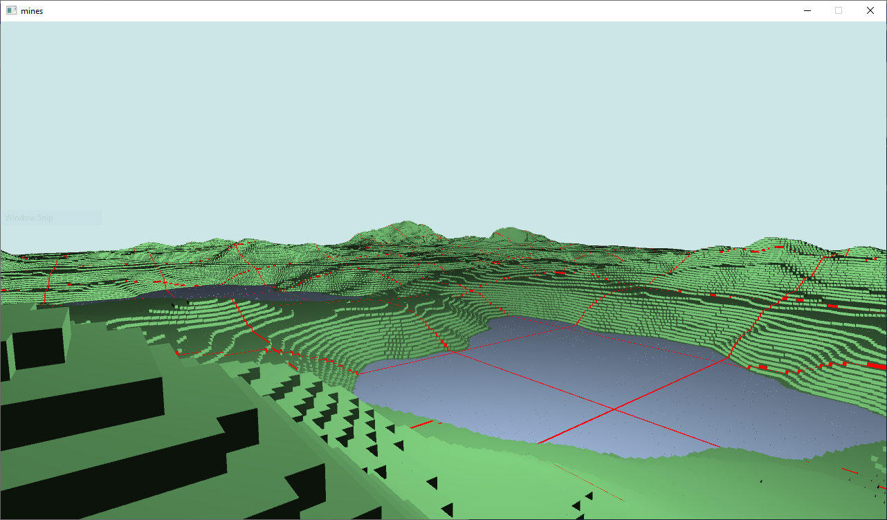

## Quickstart

- See [mines.cpp](https://github.com/aszkid/mines/blob/master/mines/EntityManager.h) for `main`.
- See [RenderSystem.h](https://github.com/aszkid/mines/blob/master/mines/RenderSystem.h) for a command-based render engine implementation (heavily inspired by Bitsquid aka Stingray).
- See [EntityManager.h](https://github.com/aszkid/mines/blob/master/mines/EntityManager.h) for my go at an ECS system design.
- See [MapSystem.cpp](https://github.com/aszkid/mines/blob/master/mines/MapSystem.cpp) for the meat of map generation, mesh optimization, and caching.
